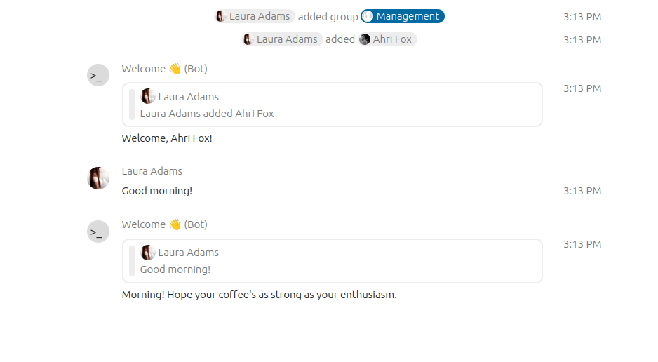

# List of available bots

If you want to write your own bot or webhook, please see the
[Bots and Webhooks developer documentation](bots.md). Afterwards send a pull
request against the [docs/bot-list.md](https://github.com/nextcloud/spreed/blob/master/docs/bot-list.md)
to add your bot to the list, using the following template:

```markdown
## Name of the bot

Useful, but short description, best to keep it to 1-3 lines of text.


* License: Identifier of the license (See https://spdx.org/licenses/)
* [Link to source code](https://github.com/nextcloud/call_summary_bot)
* [Link to installation documentation](https://github.com/nextcloud/call_summary_bot#readme)
```

Here you can find a brief overview of known bots that allows administration to
easily discover your bot and install it on their Nextcloud server.

## Call summary

The call summary bot posts an overview message after the call listing all participants and outlining tasks.


* License: AGPL-3.0-or-later
* [Link to source code](https://github.com/nextcloud/call_summary_bot)
* [Link to installation documentation](https://github.com/nextcloud/call_summary_bot#readme)

## Welcome bot

A Golang sample bot that responds to "Good morning" and "Hello" and welcomes new attendees in the room.



* License: GPL-3.0-or-later
* [Link to source code](https://github.com/nextcloud/welcome_bot)
* [Link to installation documentation](https://github.com/nextcloud/welcome_bot#readme)
